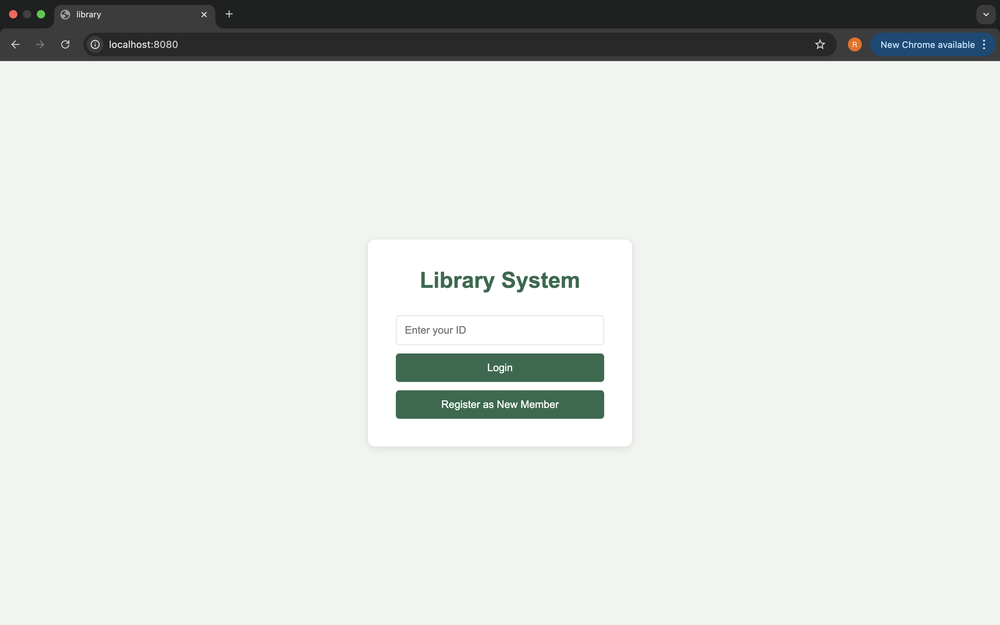
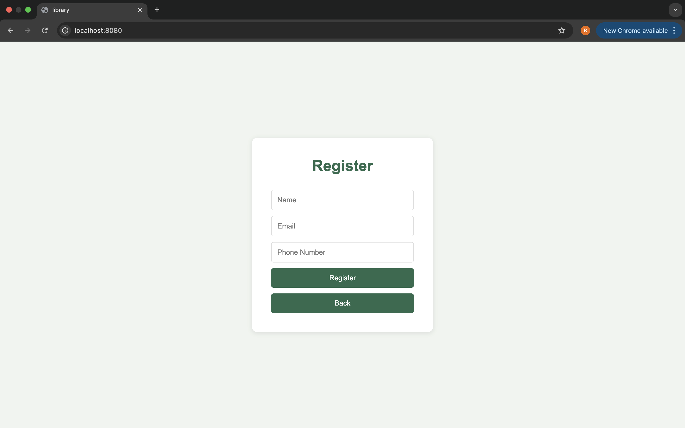
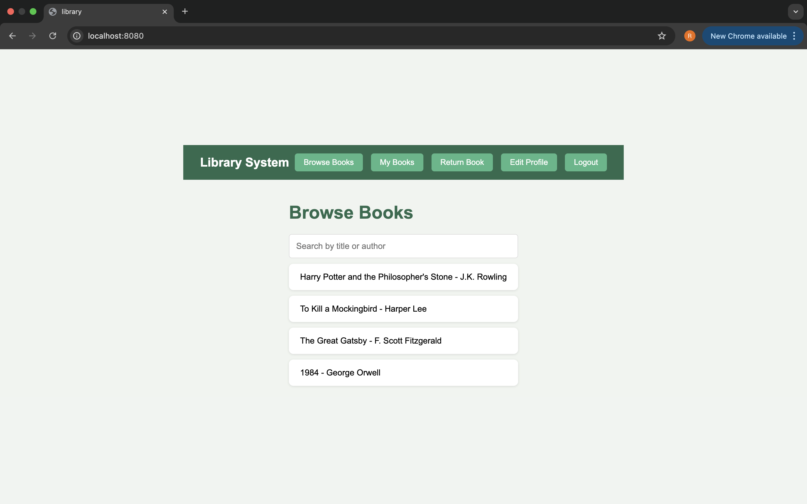
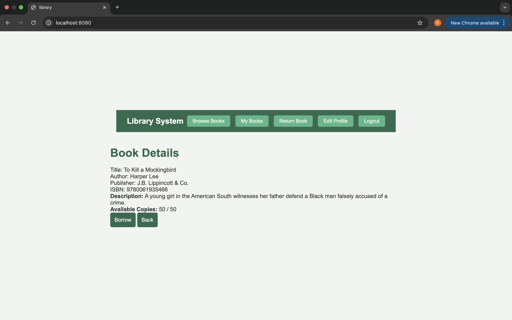
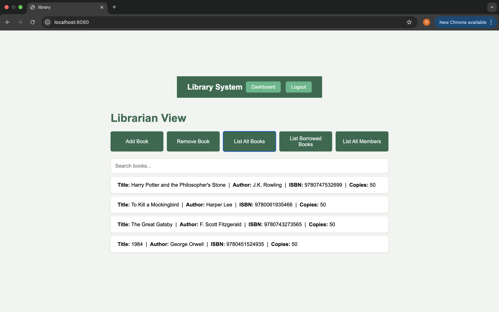

## Library Management System
A full-stack library management system where members can borrow and return books, and librarians can manage the entire system. Built with a Spring Boot REST API backend, MySQL database, and a vanilla JavaScript frontend.

## Screenshots

## Features:
1. Member registration and login
2. Browse and search books by title or author
3. Borrow and return books with due dates
4. View personal borrow history
5. Edit member profile
6. Librarian dashboard to add and remove books
7. Librarian can view borrow history for each book and member
8. Search within books, members, and borrowed books lists
9. All data persists in a MySQL database

## Tech Stack:
- Frontend: HTML, CSS, JavaScript
- Backend: Java, Spring Boot, Spring Data JPA, Hibernate
- Database: MySQL
- API: RESTful endpoints

## How to Run:
1. Make sure you have Java 21 and Maven installed
2. Make sure MySQL is running and create a database called `library_db`
3. Update `library/src/main/resources/application.properties` with your MySQL credentials (username and password)
4. Navigate to the `library/` folder in your terminal
5. Run `./mvnw spring-boot:run`
6. Open `http://localhost:8080` in your browser

## Login:
- Librarian: any ID starting with '9'
- Member: Register first, then login with your membership number

## Why I Made This:
I built this project to learn full-stack web development. It started as a frontend-only app and evolved into a complete system with a REST API and persistent database, giving me hands-on experience connecting frontend, backend, and database layers.
